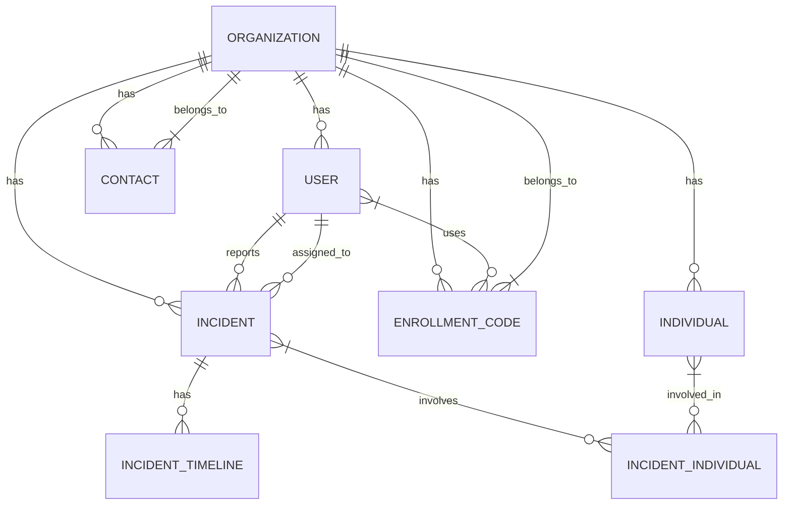

# Tracker Application

## Data Model with Sample Values

### Organizations
```
Acme Inc. (Business)
- Phone: 555-0100
- Email: info@acme.com
- Address: 123 Main St, Anytown, CA 90210, United States
- Status: Active

Springfield High School (School)
- Phone: 555-0200
- Email: info@springfield.edu
- Address: 456 School St, Springfield, IL 62701, United States
- Status: Active
```

### Users
```
Admin User
- Email: admin@tracker.com
- Phone: 555-0101
- Role: Admin
- Status: Active

John Doe
- Email: john.doe@example.com
- Phone: 555-0102
- Role: User
- Status: Active
```

### Data Model Structure



### Complete Entity Details

#### Organization
- **Id**: UUID (e.g., 00000000-0000-0000-0000-000000000001)
- **Name**: String (e.g., "Acme Inc.")
- **Type**: String (e.g., "Business", "School")
- **Phone**: String (e.g., "555-0100")
- **Email**: String (e.g., "info@acme.com")
- **Street**: String (e.g., "123 Main St")
- **City**: String (e.g., "Anytown")
- **State**: String (e.g., "CA")
- **ZipCode**: String (e.g., "90210")
- **Country**: String (e.g., "United States")
- **IsActive**: Boolean (default: true)
- **CreatedAt**: DateTime (e.g., 2023-01-01T00:00:00Z)
- **UpdatedAt**: DateTime (e.g., 2023-01-01T00:00:00Z)

#### User
- **Id**: UUID (e.g., 00000000-0000-0000-0000-000000000001)
- **FirstName**: String (e.g., "Admin")
- **LastName**: String (e.g., "User")
- **Email**: String (e.g., "admin@tracker.com")
- **PhoneNumber**: String (e.g., "555-0101")
- **Role**: String (e.g., "Admin", "User")
- **IsActive**: Boolean (default: true)
- **EmailConfirmed**: Boolean (default: true)
- **PhoneNumberConfirmed**: Boolean (default: false)
- **TwoFactorEnabled**: Boolean (default: false)
- **LockoutEnabled**: Boolean (default: false)
- **AccessFailedCount**: Integer (default: 0)
- **OrganizationId**: UUID (references Organization)
- **CreatedAt**: DateTime
- **UpdatedAt**: DateTime

#### Individual
- **Id**: UUID
- **FirstName**: String (required)
- **LastName**: String (required)
- **DateOfBirth**: DateTime? (optional)
- **Gender**: String? (optional)
- **Email**: String? (optional, validated as email)
- **Phone**: String? (optional)
- **Street**: String? (optional)
- **City**: String? (optional)
- **State**: String? (optional)
- **ZipCode**: String? (optional)
- **Country**: String? (optional)
- **OrganizationId**: UUID (required, references Organization)
- **Type**: String? (optional, based on organization type)
- **Status**: String (default: "Active")
- **CreatedAt**: DateTime
- **UpdatedAt**: DateTime

#### Contact
- **Id**: UUID
- **FirstName**: String (required)
- **LastName**: String (required)
- **Email**: String? (optional, validated as email)
- **Phone**: String? (optional)
- **Department**: String? (optional)
- **Position**: String? (optional)
- **IsPrimary**: Boolean (default: false)
- **PreferredContactMethod**: String (default: "email")
- **OrganizationId**: UUID (required, references Organization)
- **CreatedAt**: DateTime
- **UpdatedAt**: DateTime

#### EnrollmentCode
- **Id**: UUID
- **Code**: String (required, unique)
- **OrganizationId**: UUID (required, references Organization)
- **BeginDate**: DateTime (default: DateTime.UtcNow)
- **EndDate**: DateTime (required, must be after BeginDate)
- **IsActive**: Boolean (default: true)
- **Used**: Boolean (default: false)
- **UsedAt**: DateTime? (optional)
- **UsedById**: UUID? (optional, references User)
- **CreatedAt**: DateTime
- **UpdatedAt**: DateTime

#### Incident
- **Id**: UUID
- **Title**: String (required)
- **Description**: String (required)
- **Status**: String (default: "Open")
- **Severity**: String (e.g., "Low", "Medium", "High", "Critical")
- **OrganizationId**: UUID (required, references Organization)
- **ReportedById**: UUID (required, references User)
- **AssignedToId**: UUID? (optional, references User)
- **IsActive**: Boolean (default: true)
- **CreatedAt**: DateTime
- **UpdatedAt**: DateTime

#### IncidentTimeline
- **Id**: UUID
- **IncidentId**: UUID (required, references Incident)
- **Event**: String (required, e.g., "Status Changed", "Note Added")
- **Description**: String (required)
- **UpdatedById**: UUID (required, references User)
- **Timestamp**: DateTime (default: DateTime.UtcNow)
- **IsActive**: Boolean (default: true)

#### IncidentIndividual (Junction Table)
- **IncidentId**: UUID (composite PK, references Incident)
- **IndividualId**: UUID (composite PK, references Individual)
- **Role**: String (e.g., "Witness", "Affected", "Reported By")
- **Description**: String? (optional)

### Data Flow
1. Organizations are created first
2. Users are created and associated with Organizations
3. Individuals, Contacts, and EnrollmentCodes are created and linked to Organizations
4. Incidents are created and linked to Organizations, with references to Users
5. IncidentTimeline entries are created as updates to Incidents
```

## Getting Started

### Prerequisites
- .NET 6.0 SDK or later
- SQL Server (local or remote)
- Node.js (for frontend development, if applicable)

### Installation
1. Clone the repository
2. Update connection strings in `appsettings.json`
3. Run database migrations
4. Start the application

## License
This project is licensed under the MIT License - see the LICENSE file for details.
